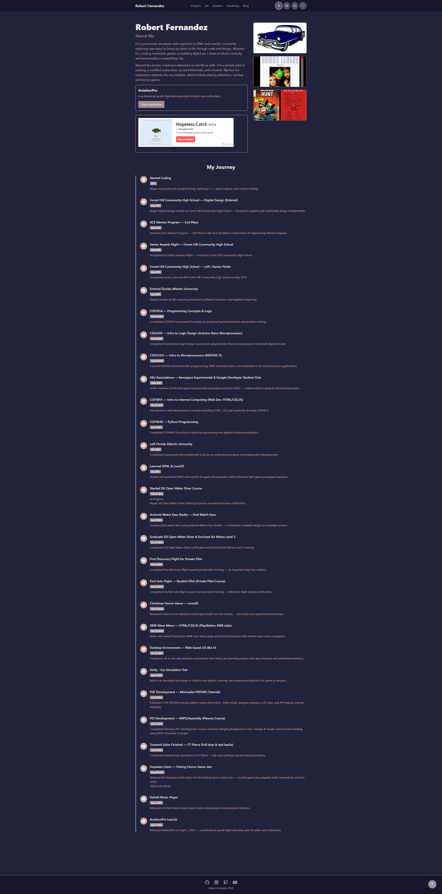
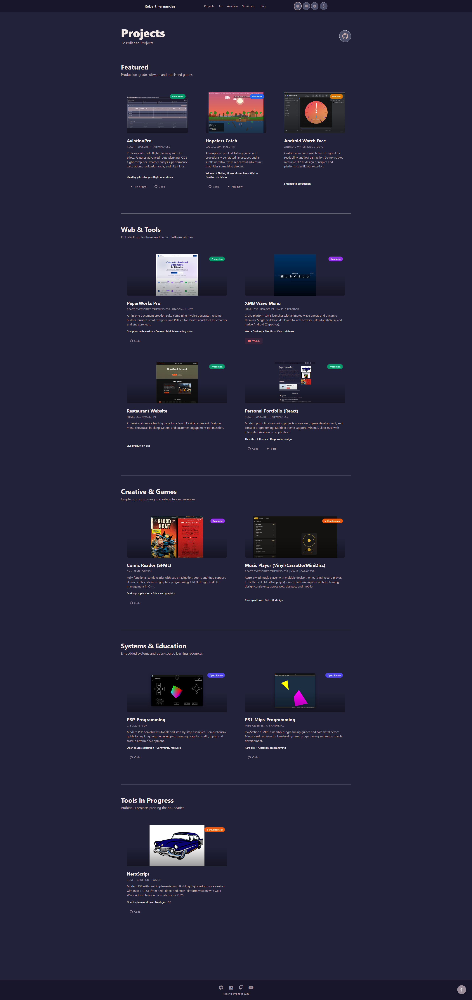
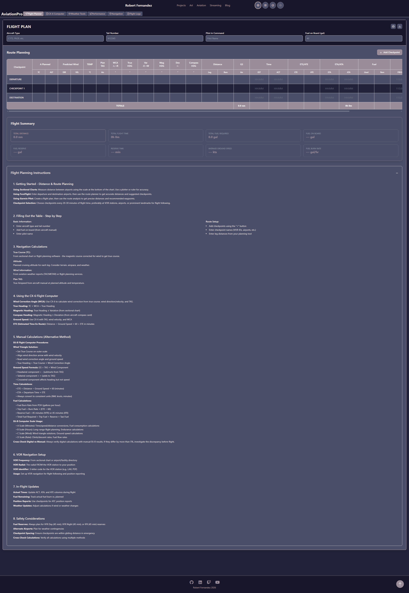
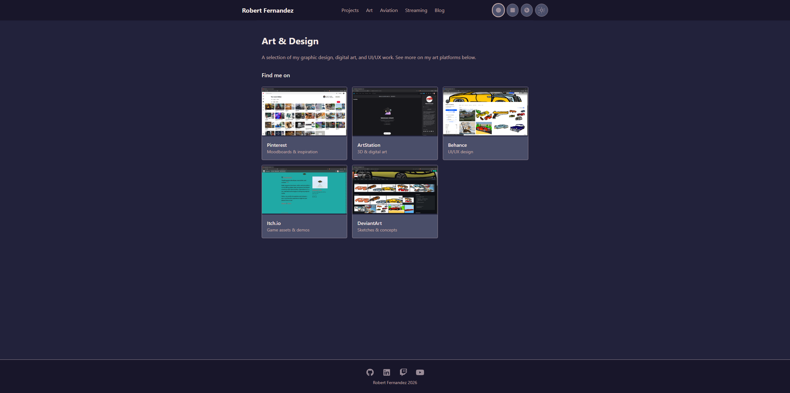
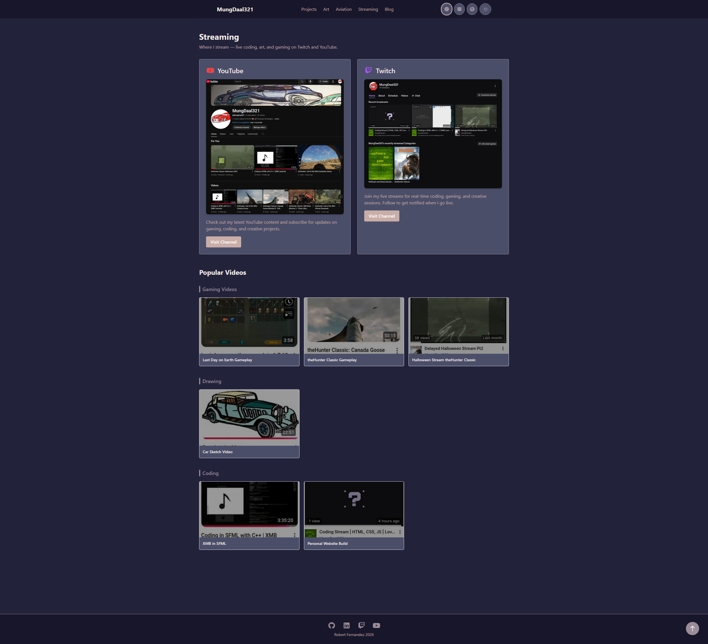
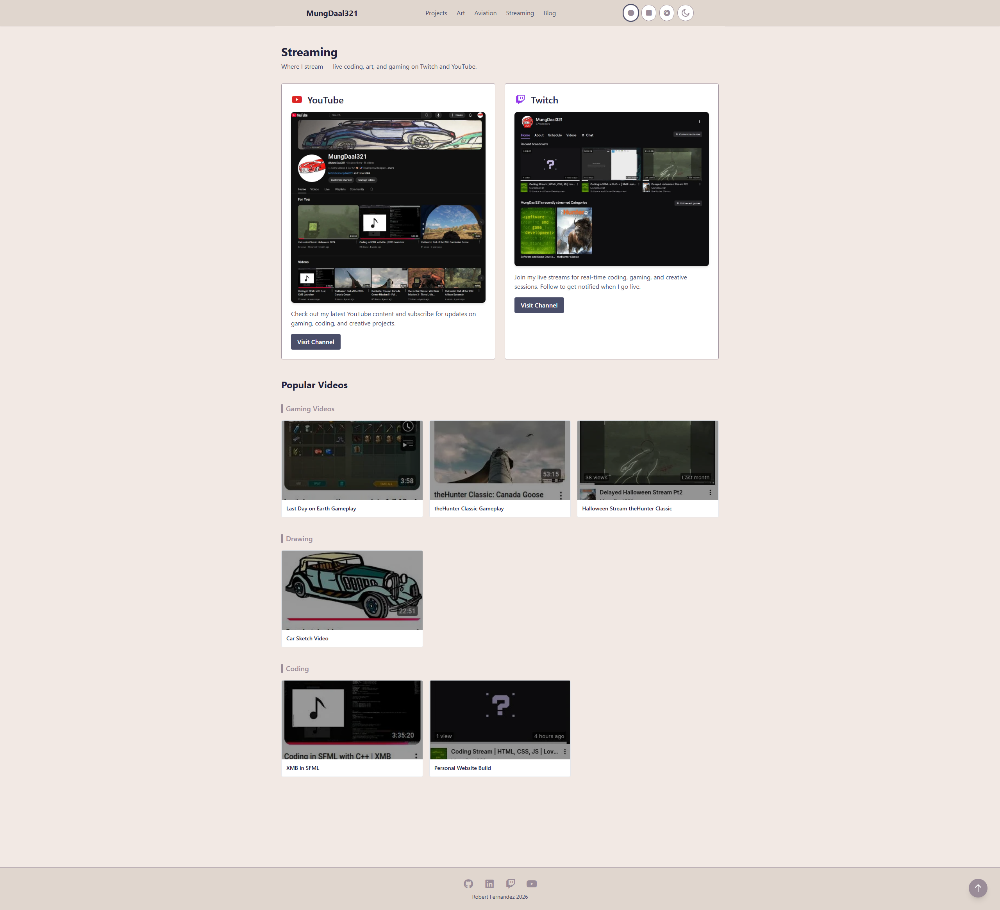
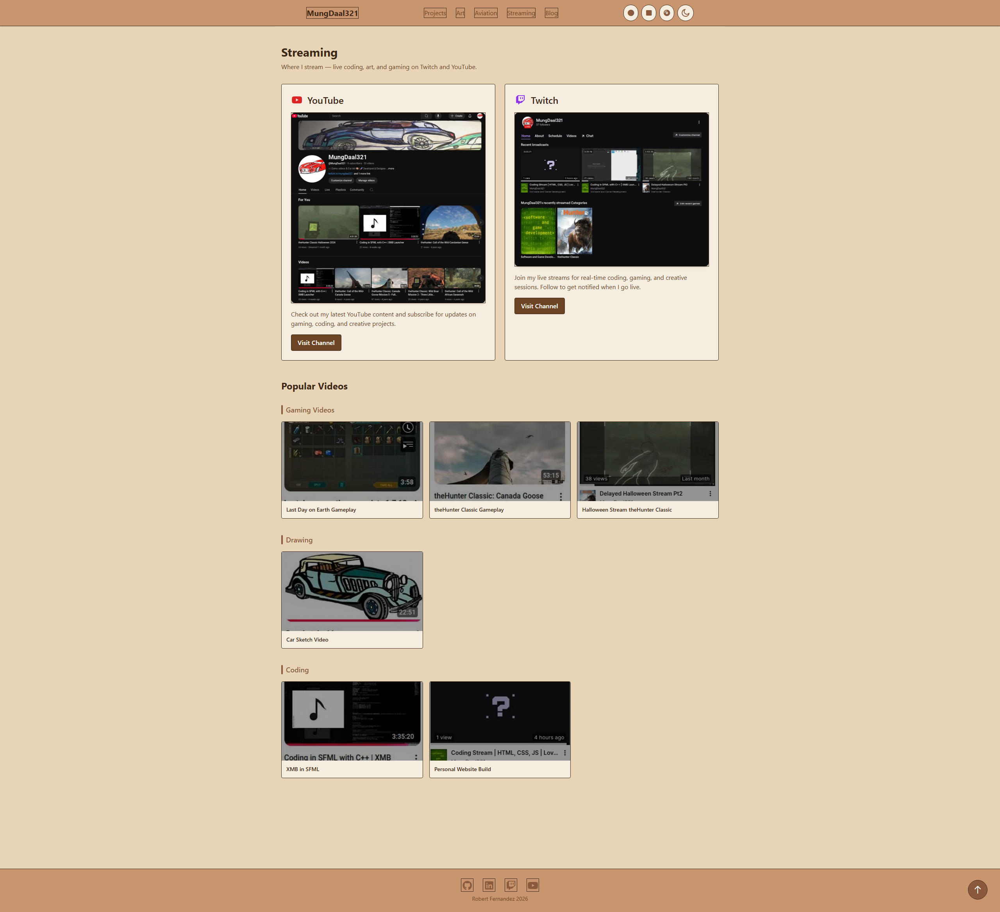
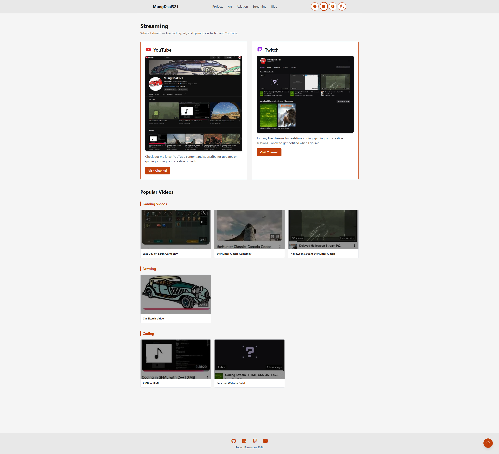
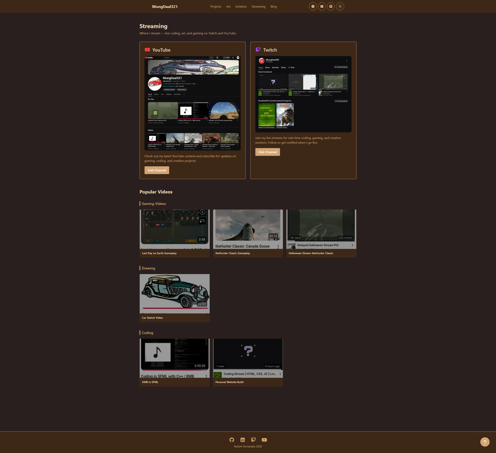
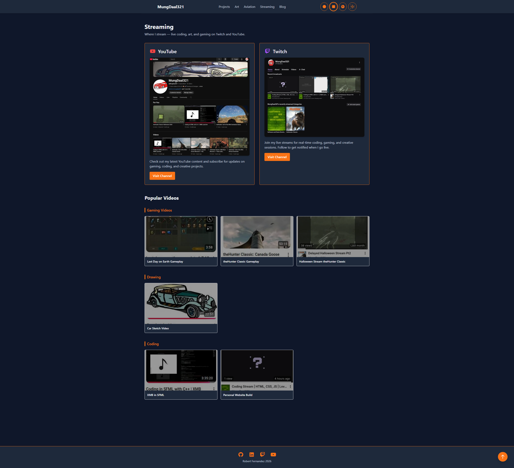

# Personal Portfolio Website - React/TypeScript/Tailwind CSS

## 🌐 Live Build

Want to see this portfolio in action? Visit the live build at **[robertfernandez.dev](https://robertfernandez.dev)**

## 📸 Screenshots


<b>Note:</b> The screenshots below are for the <b>Dark Minimal</b> theme. See more theme previews further down.

| Home Page | Projects | Aviation | Art | Streaming |
|-----------|----------|----------|-----|-----------|
|  |  |  |  |  |

Other themes:  

<div align="center">
<b>Theme Previews:</b><br>
Light Minimal<br>

<br>Light 90s<br>

<br>Light Slate<br>

<br>Dark 90s<br>

<br>Dark Slate<br>

</div>

# ...existing code...
# Personal Portfolio Website - React/TypeScript/Tailwind CSS

> **Modern Framework Edition** - A comprehensive multi-page portfolio built with React, TypeScript, and Tailwind CSS, showcasing my journey as a developer, artist, pilot, and content creator.

**Repository**: [React Portfolio](https://github.com/robfernan/react-portfolio)  
**Original Version**: [HTML/CSS/JS Portfolio](https://github.com/robfernan/html-css-js-portfolio)

## 🎯 About

This is my **modern, component-based rebuild** of my foundational HTML/CSS/JavaScript portfolio. It demonstrates my progression to professional-grade web development using industry-standard tools and frameworks.

Built with:
- **React 18** - Component-based architecture for reusability and maintainability
- **TypeScript** - Full type safety and better developer experience
- **Tailwind CSS** - Utility-first styling for rapid, consistent UI development
- **Vite** - Lightning-fast build tool with Hot Module Replacement (HMR)
- **React Router v6** - Client-side routing for seamless SPA navigation

The site showcases my diverse background across:
- **Software Development** (SFML, Love2D, Web Development)
- **Digital Art & 3D Modeling**
- **Aviation** (Student Pilot with flight planning tools)
- **Content Creation** (Streaming and game development)

## ✨ Features

### 🎨 Design & UX
- **Component-Based Architecture** - Reusable React components for consistency and maintainability
- **Responsive Design** - Mobile-first approach with Tailwind's responsive utilities
- **Smooth Animations** - Custom CSS animations (fadeInUp, slideInLeft, pulse) with React integration
- **Theme System** - CSS custom properties for consistent theming across components
- **Interactive Elements** - Hover effects, transitions, and micro-interactions

### 🛠️ Technical Features
- **TypeScript** - Full type safety across all components and utilities
- **React Hooks** - Modern state management with useState, useEffect, useContext
- **React Router v6** - Client-side routing with nested routes and lazy loading
- **Vite** - Ultra-fast development server with HMR for instant feedback
- **Tailwind CSS** - Utility-first CSS framework for rapid UI development
- **Component Composition** - Reusable, composable components for DRY code
- **Hot Module Replacement** - See changes instantly without full page reload

### 🧮 Interactive Tools
- **Aviation Calculators** - Cloud base, crosswind, density altitude, fuel planning
- **Real-time Weather Integration** - Live METAR data for flight planning
- **Weight & Balance Calculator** - Cessna 172 performance calculations
- **Interactive Checklists** - Pre-flight procedures with progress tracking
- **Project Filtering** - Dynamic content filtering by technology/category
- **Image Galleries** - Responsive galleries with smooth transitions

## What this repo is for

- Host a living snapshot of Robert's portfolio website and project assets.
- Provide source for the web UI (Vite + React/TypeScript + Tailwind CSS) and supporting media assets.
- Include the `AviationPro` app sources under `src/aviationpro` for reference and development.
- Serve as a reference for modern React portfolio architecture and component design patterns.

## 🛠️ Tech Stack

- **React 18** - Modern UI library with hooks and concurrent features
- **TypeScript** - Static typing for safer, more maintainable code
- **Tailwind CSS** - Utility-first CSS framework for rapid development
- **Vite** - Next-generation build tool with lightning-fast HMR
- **React Router v6** - Client-side routing for SPA navigation
- **FontAwesome 7** - Comprehensive icon library
- **Lucide React** - Beautiful, consistent icon components
- **PostCSS** - CSS transformation and optimization
- **Autoprefixer** - Automatic vendor prefixes for cross-browser support

## 📄 Pages Overview

### 🏠 Home (`PortfolioHome.tsx`)
- Interactive timeline of my journey (2012-2025)
- Smooth scroll-triggered animations
- Featured projects showcase
- Skills breakdown by category
- Call-to-action buttons for navigation

### 💻 Coding (`Projects.tsx`)
- **12 Polished Projects** organized into 5 categories
- **Featured**: AviationPro, Hopeless Catch, Android Watch Face
- **Web & Tools**: PaperWorks Pro, XMB Wave Menu, Restaurant Website, Personal Portfolio
- **Creative & Games**: Comic Reader (SFML), Music Player (Vinyl/Cassette/MiniDisc)
- **Systems & Education**: PSP-Programming, PS1-Mips-Programming
- **Tools in Progress**: NeroScript (Rust + GPUI, Go + Wails)
- Project cards with images, tech stack, status badges, and direct links
- Responsive grid layout with smooth scroll animations
- GitHub links, live demos, and YouTube videos

### 🎨 Art (`Art.tsx`)
- Platform integration links (ArtStation, DeviantArt, Behance, etc.)
- Interactive gallery with smooth transitions
- 3D model viewer integration
- Responsive image grid with lightbox functionality

### ✈️ Aviation (`AviationProApp.tsx`)
- Flight planning calculators and tools
- Live METAR weather widget
- VFR weather minimums reference table
- Pre-flight checklist with interactive checkboxes
- Weight & balance calculator for Cessna 172
- Embedded as full sub-project under `src/aviationpro/`

### 📺 Streaming (`Streaming.tsx`)
- YouTube and Twitch integration
- Video thumbnails organized by category
- Direct links to popular content
- Platform-specific styling and branding

### 📝 Blog (`Blog.tsx`)
- [Currently undecided] — May be used for devlogs, tutorials, or personal posts in the future

## 📁 Repo layout (quick)

- `public/` — images and static assets used by the site.
- `src/` — primary site source files (React components, styles, entry points).
  - `src/components/` — reusable React components (navigation, cards, sections, etc.).
  - `src/*.tsx` — main page components (PortfolioHome, Projects, Art, Streaming, Blog, etc.).
  - `src/index.css` — global styles and Tailwind directives.
  - `src/theme-vars.css` — CSS custom properties for theming.
  - `src/main.tsx` — React entry point.
- `src/aviationpro/` — an included application (full project) related to AviationPro.
- `.gitignore` — common ignores for node artifacts and IDE files.
- `tailwind.config.js` — Tailwind CSS configuration for custom theme and plugins.
- `vite.config.ts` — Vite build configuration.

## 🎯 Featured Projects (12 Polished)

### Production & Published
- **AviationPro** — Professional flight planning suite for pilots (React, TypeScript, Tailwind CSS)
- **Hopeless Catch** — Atmospheric pixel art fishing game (Love2D, Lua) — [Play on itch.io](https://mungdaal321.itch.io/hopeless-catch)
- **Android Watch Face** — Minimalist wearable UI design (Android Watch Face Studio)

### Web & Tools
- **PaperWorks Pro** — All-in-one document creation suite (React, TypeScript, Tailwind CSS)
- **XMB Wave Menu** — Cross-platform launcher with wave effects (HTML/CSS/JS, NW.js, Capacitor)
- **Restaurant Website** — Professional service landing page (HTML, CSS, JavaScript)
- **Personal Portfolio** — This site! (React, TypeScript, Tailwind CSS)

### Creative & Games
- **Comic Reader (SFML)** — Fully functional comic reader with advanced graphics (C++, SFML, OpenGL)
- **Music Player (Vinyl/Cassette/MiniDisc)** — Retro-styled cross-platform player (React, TypeScript, Tailwind CSS)

### Systems & Education
- **PSP-Programming** — Modern PSP homebrew tutorials (C, SDL2, PSPSDK)
- **PS1-Mips-Programming** — PlayStation 1 MIPS assembly guides (MIPS Assembly, C, Baremetal)

### Tools in Progress
- **NeroScript** — Modern IDE with dual implementations (Rust + GPUI, Go + Wails)

## � React vso. Original HTML/CSS/JS Version

This React version is a **modern rebuild** of my original HTML/CSS/JS portfolio. Both showcase the same content and features, but with different technical approaches:

| Aspect | React/TypeScript/Tailwind | Original HTML/CSS/JS |
|--------|---------------------------|----------------------|
| **Architecture** | Component-based, reusable React components | Monolithic HTML pages with inline scripts |
| **Styling** | Utility-first Tailwind CSS classes | Custom CSS files with manual class definitions |
| **Type Safety** | Full TypeScript support with strict typing | No type checking (vanilla JavaScript) |
| **State Management** | React hooks (useState, useEffect, useContext) | DOM manipulation and global variables |
| **Routing** | React Router v6 for SPA navigation | Traditional multi-page or hash-based routing |
| **Build Process** | Vite (fast HMR, optimized bundles) | Simple HTTP serving or manual bundling |
| **Maintainability** | Easier to refactor and extend with components | Harder to maintain as complexity grows |
| **Performance** | Optimized code splitting and lazy loading | Single bundle or multiple page loads |
| **Developer Experience** | Hot Module Replacement (HMR), instant feedback | Manual refresh required for changes |
| **Learning Value** | Modern framework best practices | Foundational web development skills |


## 🚀 Development (local)

You need Node.js (v16+) and npm installed. From the repository root:

```bash
# Install dependencies
npm install

# Start development server with hot reload
npm run dev

# Build for production
npm run build

# Preview production build locally
npm run preview
```

The development server typically runs on `http://localhost:5173` with Vite's Hot Module Replacement (HMR) enabled, so changes to components and styles are reflected instantly without a full page reload.

### Key npm scripts

- `dev` — start Vite development server with HMR
- `build` — build optimized production bundle
- `preview` — serve the production build locally for testing

### Development Tips

- **Component Development**: Edit `.tsx` files in `src/` and see changes instantly via HMR.
- **Styling**: Modify Tailwind classes directly in components or add custom styles in `src/index.css`.
- **Theme Customization**: Update CSS variables in `src/theme-vars.css` or Tailwind config in `tailwind.config.js`.
- **Type Checking**: TypeScript will catch errors during development; check the console for type issues.
- **Browser DevTools**: React DevTools extension recommended for debugging component state and props.

## 📁 Project Structure & Component Organization

```
src/
├── components/          # Reusable React components
│   ├── Navigation.tsx   # Header/nav bar
│   ├── Footer.tsx       # Footer component
│   ├── ProjectCard.tsx  # Individual project card
│   └── ...
├── App.tsx              # Main app router and layout
├── PortfolioHome.tsx    # Home page
├── Projects.tsx         # Projects page
├── Art.tsx              # Art gallery page
├── Streaming.tsx        # Streaming info page
├── Blog.tsx             # Blog page (optional)
├── main.tsx             # React entry point
├── index.css            # Global styles + Tailwind directives
├── theme-vars.css       # CSS custom properties for theming
└── aviationpro/         # Nested AviationPro sub-project
```

## Styling & Theming

- **Tailwind CSS**: Utility-first CSS framework for rapid UI development.
- **Custom Theme**: CSS variables defined in `src/theme-vars.css` for consistent colors and spacing.
- **Dark Mode**: Tailwind's dark mode support for theme switching.
- **Responsive Design**: Mobile-first approach with Tailwind's responsive prefixes (sm, md, lg, xl).
- **Custom Animations**: Defined in `src/index.css` (fadeInUp, slideInLeft, pulse, etc.).

## 🎓 Key Learnings & Best Practices

This project demonstrates:

### React & TypeScript Skills
- **Component Architecture** - Building reusable, composable components
- **React Hooks** - Modern state management patterns (useState, useEffect, useContext)
- **TypeScript** - Type safety, interfaces, and generic components
- **React Router** - Client-side routing and nested routes
- **Performance Optimization** - Code splitting, lazy loading, memoization

### CSS & Styling Skills
- **Tailwind CSS** - Utility-first CSS for rapid development
- **Responsive Design** - Mobile-first approach with breakpoints
- **CSS Animations** - Custom animations and transitions
- **Theme System** - CSS custom properties for consistent theming
- **Accessibility** - Semantic HTML and ARIA attributes

### Web Development Best Practices
- **Component Composition** - DRY principles and reusability
- **Type Safety** - Catching errors at compile time
- **Performance** - Optimized builds and efficient rendering
- **Accessibility** - WCAG compliance and keyboard navigation
- **Code Organization** - Modular structure and maintainability

## 🌟 Comparison with HTML/CSS/JS Version

**This Portfolio** (React/TypeScript/Tailwind):
- Modern framework architecture with component reusability
- Type safety with TypeScript
- Utility-first CSS with Tailwind
- Hot Module Replacement for instant feedback
- Optimized production builds with code splitting

**Original Portfolio** (HTML/CSS/JS):
- Foundational web development with vanilla technologies
- Custom CSS architecture and manual DOM manipulation
- Direct browser serving without build process
- Demonstrates core web fundamentals
- Great for learning pure HTML, CSS, and JavaScript

Together, they showcase my progression from foundational web development to modern, scalable application architecture.
