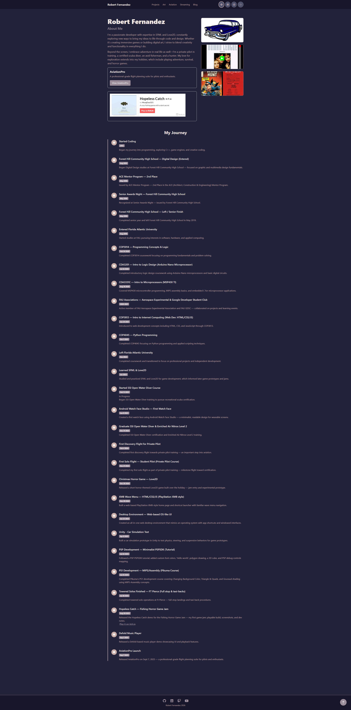
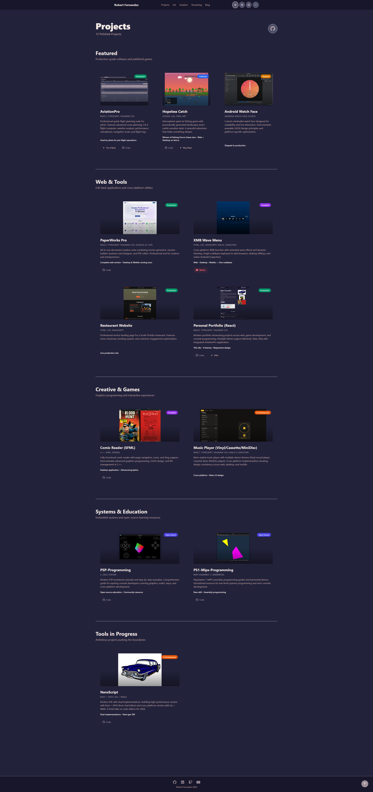
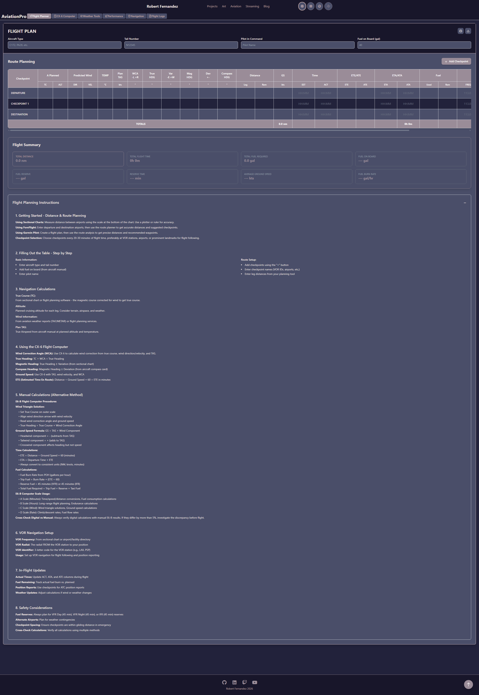
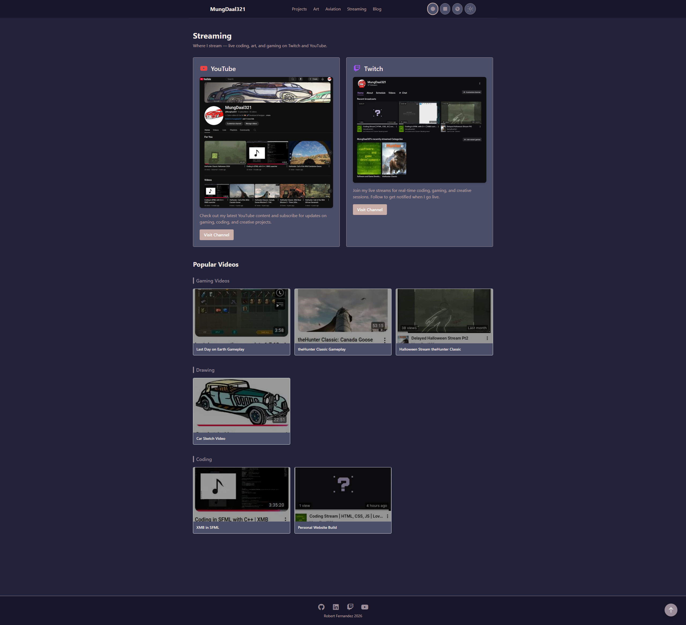
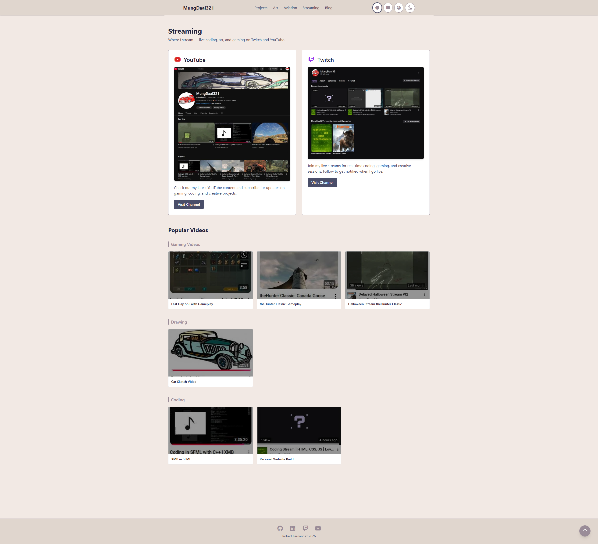
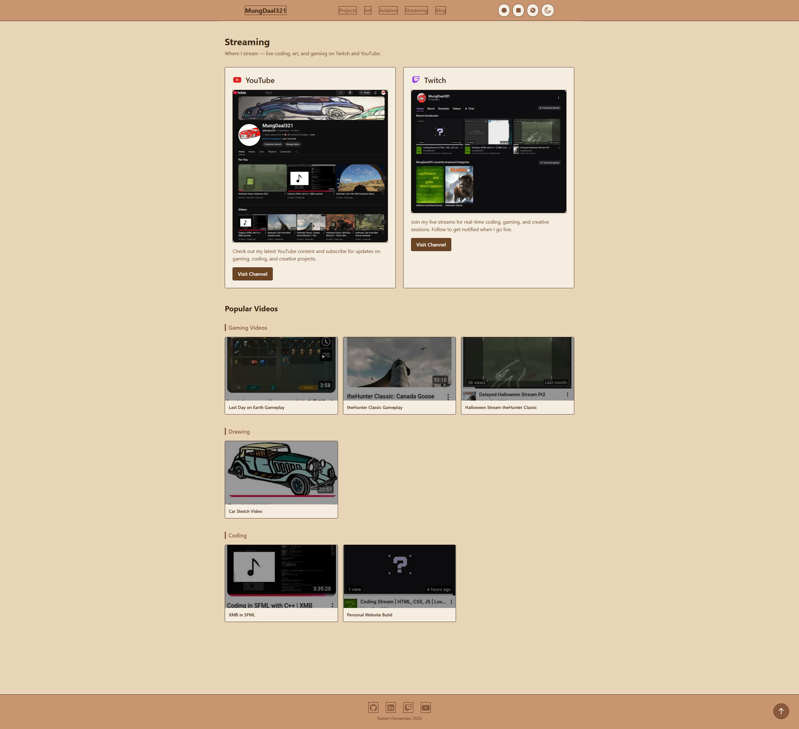
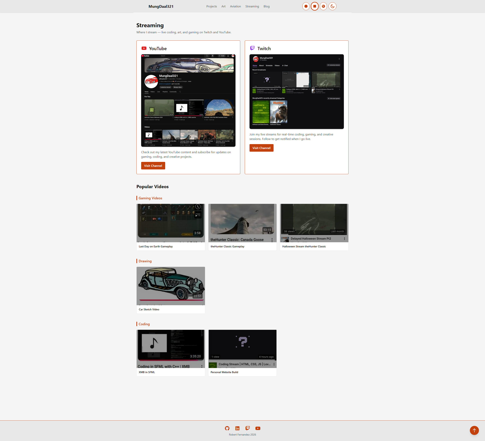
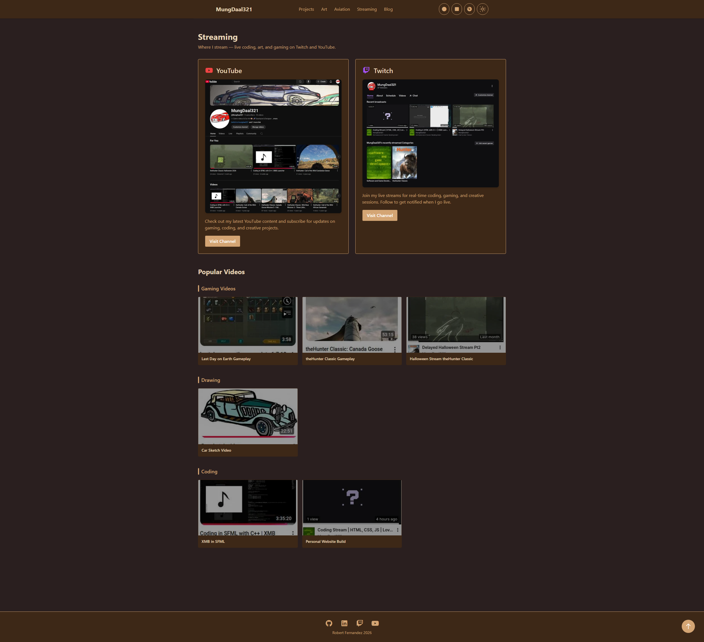
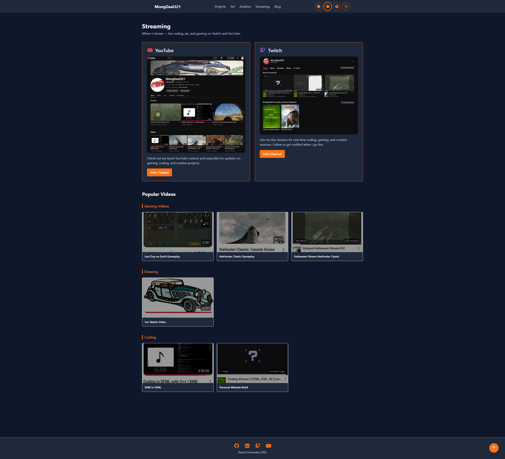

# Personal Portfolio Website — React / TypeScript / Tailwind CSS

A multi-page personal portfolio built with **React 19**, **TypeScript**, and **Tailwind CSS v4**. It showcases my work as a cross-platform software engineer, digital artist, pilot, and content creator — including an embedded professional flight-planning suite (AviationPro) and a print-ready résumé.

**Live:** [robertfernandez.dev](https://robertfernandez.dev) · **Repo:** [robfernan/react-portfolio](https://github.com/robfernan/react-portfolio)
**Original version:** [HTML/CSS/JS Portfolio](https://github.com/robfernan/html-css-js-portfolio)

## 📸 Screenshots

> The screenshots below are for the **Dark Minimal** theme. More theme previews further down.

| Home | Works (Magazine) | Aviation | Streaming |
|------|------------------|----------|-----------|
|  |  |  |  |

Other themes:

<div align="center">
<b>Theme Previews:</b><br>
Light Minimal<br>

<br>Light 90s<br>

<br>Light Slate<br>

<br>Dark 90s<br>

<br>Dark Slate<br>

</div>

## 🎯 About

This is a **modern, component-based rebuild** of my foundational HTML/CSS/JavaScript portfolio. It demonstrates progression to professional-grade web development using industry-standard tooling:

- **React 19** — component architecture for reusability and maintainability
- **TypeScript** — full type safety across components and utilities
- **Tailwind CSS v4** — utility-first styling with a custom theme-token system
- **Vite** — fast dev server (HMR) and optimized production builds
- **React Router v6** — client-side routing for seamless SPA navigation

The site spans:

- **Software development** — web, desktop (Go/Wails, C++/SFML), mobile (Capacitor), Wear OS, embedded displays, retro consoles
- **Digital art & design** — brand identity, UI/UX, Adobe Creative Cloud
- **Aviation** — student pilot with an integrated flight-planning suite
- **Content creation** — streaming and game development

## ✨ Features

### 🎨 Design & UX
- **Component-based architecture** — reusable React components for consistency
- **Responsive design** — mobile-first, fully supports iPhone SE (375px) viewports; desktop layouts tuned for 1080p+ legibility
- **Theme system** — CSS custom properties (`theme-*` tokens) with 4 switchable themes + light/dark mode
  - **90s theme dark mode** uses a warm gold-on-black palette (near-black canvas, glowing gold accent `#e8b24a`, warm off-white text) for a CRT/VHS feel — no blue/aqua cast.
- **Interactive elements** — hover states, transitions, and micro-interactions

### 🛠️ Technical
- **TypeScript** — strict typing across all components and utilities
- **React hooks & context** — state management via `useState`, `useEffect`, `ThemeProvider`
- **Tailwind CSS v4** — utility-first styling with a custom PostCSS pipeline
- **Vite** — HMR for instant feedback, optimized code-split production bundles

### 🧮 Interactive tools (AviationPro)
- Flight planner with wind correction, fuel tracking, VOR data, print & JSON export
- CX-6 computer: wind triangle, TAS, time-speed-distance, crosswind calculators
- Live METAR/TAF weather fetcher with VFR/IFR/MVFR/LVFR analysis
- Weight & balance calculator with CG envelope visualization and Go/No-Go validation
- Navigation tools: distance/bearing, unit conversions, time-zone converter
- Persistent logbook (Dexie/localStorage) with search, filter, sort, CSV export

## 📄 Pages Overview

| Route | Component | Description |
|-------|-----------|-------------|
| `/` | `PortfolioHome.tsx` | Home — journey timeline, featured projects, watch-face showcase, CTAs |
| `/works`, `/work`, `/projects` | `magazine/Magazine.tsx` | Works — two-page "book spread" project gallery (desktop) with art-platform links |
| `/aviationpro/*` | `aviationpro/AviationProApp.tsx` | AviationPro — full flight-planning suite embedded in the site |
| `/streaming` | `Streaming.tsx` | Streaming — YouTube & Twitch content, organized by category |
| `/resume` | `Resume.tsx` | Résumé — general-overview CV with a print/PDF one-pager export |

### 📝 Résumé (`/resume`)
A **general-overview résumé** designed for recruiters who land on the site after an application. Sections: profile, professional experience (primary role + independent/freelance studio), core technical skills, education & certifications, and selected projects — with bilingual (English/Spanish) noted throughout.

- **Print / PDF export** — a "Print / PDF" button triggers `window.print()`, and a dedicated `@media print` block in `src/index.css` produces a clean, high-contrast **single-page** document: it hides site chrome and decorative elements, forces a light palette, equalizes the Education + Selected Projects columns, and compacts spacing so everything fits on one US Letter page at 100% scale.
- Contact links (portfolio / GitHub / LinkedIn) render in the header for both screen and print.

## 🛠️ Tech Stack

| Category | Technology |
|----------|------------|
| UI framework | React 19, React DOM 19 |
| Language | TypeScript |
| Styling | Tailwind CSS v4 (PostCSS + Autoprefixer), `tailwindcss-animate` |
| Build tool | Vite 8 (`@vitejs/plugin-react`) |
| Routing | React Router v6 |
| Icons | FontAwesome Free, Lucide React |
| Data / persistence | Dexie (+ `dexie-react-hooks`) for the AviationPro logbook |
| PDF export | jsPDF (AviationPro) + browser print stylesheet (Résumé) |
| UI primitives | Radix UI (`@radix-ui/react-slot`) |

## 📁 Project Structure

```
├── index.html                 # Vite entry HTML
├── public/                    # Static assets: images, screenshots, fonts
├── src/
│   ├── main.tsx               # React entry point
│   ├── App.tsx                # Router, theme provider, global header/nav + theme controls
│   ├── PortfolioHome.tsx      # Home page (/)
│   ├── Resume.tsx             # Résumé page (/resume) — includes print/PDF support
│   ├── Streaming.tsx          # Streaming page (/streaming)
│   ├── Footer.tsx             # Site footer with social links
│   ├── index.css              # Global styles, Tailwind v4 theme tokens, @media print block
│   ├── theme-vars.css         # CSS custom properties for the 4 switchable themes
│   ├── context/               # ThemeProvider (theme + dark-mode state)
│   ├── components/
│   │   ├── layout/Layout.tsx
│   │   └── ui/                # Button, Card, Dialog, Input, BackToTop, LoadingSpinner, cn util
│   ├── magazine/              # Works page: Magazine.tsx, MagazineUI.tsx, data.ts (projects + art platforms)
│   └── aviationpro/           # Embedded AviationPro app (full sub-project under src/)
├── tailwind.config.js         # Tailwind config (theme tokens, xs breakpoint, plugins)
├── postcss.config.js          # PostCSS pipeline for Tailwind v4
├── vite.config.ts             # Vite build configuration
└── tsconfig.json              # TypeScript configuration
```

## 🎯 Featured Projects

### Production & published
- **AviationPro** — professional flight-planning suite (React, TypeScript, Tailwind CSS)
- **Hopeless Catch** — atmospheric pixel-art fishing game (Love2D, Lua) — [Play on itch.io](https://mungdaal321.itch.io/hopeless-catch)
- **Android Watch Face** — minimalist wearable UI design (Samsung Watch Face Studio)

### Web & tools
- **PaperWorks Pro** — all-in-one document creation suite (React, TypeScript, Tailwind CSS)
- **XMB Wave Menu** — cross-platform launcher with wave effects (HTML/CSS/JS, NW.js, Capacitor)
- **Restaurant website** — professional service landing page (HTML, CSS, JavaScript)
- **Personal portfolio** — this site (React, TypeScript, Tailwind CSS)

### Creative & games
- **Comic Reader (SFML)** — fully functional comic reader with advanced graphics (C++, SFML, OpenGL)
- **Music Player (Vinyl/Cassette/MiniDisc)** — retro-styled cross-platform player (React, TypeScript, Tailwind CSS)

### Systems & education
- **PSP Programming** — modern PSP homebrew tutorials (C, SDL2, PSPSDK)
- **PS1 MIPS Programming** — PlayStation 1 MIPS assembly guides (MIPS Assembly, C, baremetal)

## 🚀 Development (local)

Requires Node.js and npm. From the repository root:

```bash
# Install dependencies
npm install

# Start the dev server with hot reload
npm run dev          # typically http://localhost:5173

# Build for production
npm run build

# Preview the production build locally
npm run preview
```

### Key npm scripts
- `dev` — start Vite dev server with HMR
- `build` — build the optimized production bundle
- `preview` — serve the production build locally

### Development tips
- **Components** — edit `.tsx` files in `src/`; changes apply instantly via HMR.
- **Styling** — use Tailwind utilities inline, or add custom rules to `src/index.css`.
- **Theming** — theme palettes live in `src/theme-vars.css`; token→utility mapping is in `tailwind.config.js` and the `@theme` block in `src/index.css`.
- **Print styles** — the résumé's one-page PDF output is controlled by the `@media print` block at the bottom of `src/index.css`.

## 🎓 Key Learnings & Best Practices

- **Component architecture** — reusable, composable components with a shared UI kit (`components/ui`)
- **Type safety** — interfaces and generics across data models (magazine entries, AviationPro state)
- **Theming at scale** — CSS custom properties + Tailwind tokens for consistent light/dark theming across an embedded sub-app
- **Responsive design** — mobile-first with iPhone SE as the minimum target; verified print layout via headless Chrome
- **Performance** — code splitting, lazy-loaded routes, optimized bundles
- **Accessibility** — semantic HTML, ARIA labels on icon-only controls, keyboard-navigable UI

## 🌟 React vs. Original HTML/CSS/JS Version

| Aspect | This repo (React/TS/Tailwind) | Original (HTML/CSS/JS) |
|--------|-------------------------------|------------------------|
| Architecture | Component-based, reusable | Monolithic pages with inline scripts |
| Styling | Tailwind utilities + theme tokens | Custom CSS files |
| Type safety | Full TypeScript | Vanilla JavaScript |
| State | React hooks & context | DOM manipulation / globals |
| Routing | React Router (SPA) | Multi-page / hash routing |
| Build | Vite (HMR, optimized bundles) | Static serving |

Together they show progression from foundational web development to modern, scalable application architecture.
