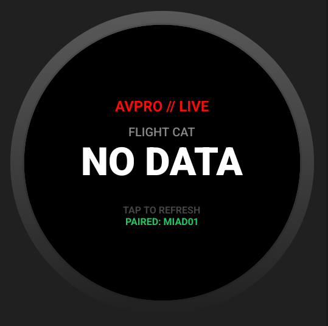
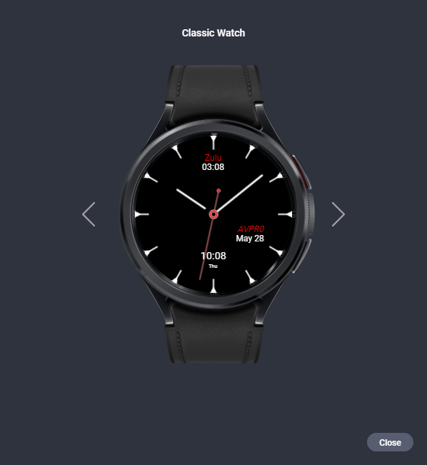

# ✈️ Aviation Pro
### The High-Performance, Design-First Pilot Suite for Desktop, Mobile, and Wear OS.

[-red?style=for-the-badge&logo=go)](https://wails.io/)
[](https://reactjs.org/)
[](https://capacitorjs.com/)
[](https://developer.android.com/wear)

**Aviation Pro** is a professional-grade pilot utility suite built for precision and visibility. Engineered with a **Unified UI Architecture**, it delivers a seamless experience across frameless desktop environments (Wails), native mobile EFBs (Capacitor), and the pilot's wrist (Wear OS).

> **Current Status:** 🚀 **Beta v1.0.0 Ready**. Now fully functional on Windows Desktop, Android Mobile (MIAD01 Optimized), and Wear OS (Pixel Watch 1/2/3).

---

## 🖼️ The Multi-Platform Ecosystem

| **Desktop (Wails)** | **Mobile (Capacitor)** | **Watch App (Wear OS)** | **Watch Face (WFF)** |
| :--- | :--- | :--- | :--- |
|  |  |  |  |
| *Hardware-style frameless canvas.* | *Responsive, touch-ready EFB.* | *Live Sync METAR Monitor.* | *Zulu-first Aviator Face.* |

---

## 💰 The Value Proposition & Philosophy
Aviation Pro is designed to disrupt the "Subscription-Heavy" aviation market. While industry standards cost hundreds per year, AVPRO provides a high-end, unified experience for a fraction of the cost.

**AVPRO is Open Source and free on Desktop and Web.** The mobile port (Android/Wear OS) is a one-time purchase of **$0.99** to cover publishing costs and maintenance.

> **One-Time Purchase Policy:** We believe aviation tools should be like classic games: pay once, own it forever. Subscriptions are only worth it when you are renting massive cloud databases—for a pilot's personal utility suite, local data sovereignty is king.

| Feature | **AVPRO** | **E6BX (App)** | **LogTen Pro** | **ForeFlight** |
| :--- | :--- | :--- | :--- | :--- |
| **Cost** | **$0.99 (One-time)** | Outdated / Varies | $79 - $349 / yr | $99 - $360 / yr |
| **Architecture** | **Modern / Native** | Legacy / Older Android | Subscription | Subscription |
| **Watch Integration** | **Included (Face + App)** | None | Limited | iOS Only |
| **Privacy** | **Local-First** | Ad-Supported (Web) | Cloud-Based | Cloud-Based |

---

## ⚙️ Installation & Setup

### Prerequisites
*   **Node.js (v18+)** & **NPM**
*   **Go (1.21+)** (For Desktop Wails)
*   **Android Studio** (For Mobile/Watch builds)
*   **Wails CLI** (`go install github.com/wailsapp/wails/v2/cmd/wails@latest`)

### 🌐 Web Deployment (Local Preview)
To run the core flight planning logic in your browser:
```bash
# Install dependencies
npm install

# Run Vite dev server
npm run dev
```

### 💻 Desktop Deployment (Wails)
To launch the frameless desktop canvas:
```bash
# Navigate to the wails platform folder
cd platforms/desktop/wails

# Run in development mode
wails dev
```

### 📱 Mobile & Watch Deployment (Capacitor)
Both the phone and watch apps use a unified ID (`com.aviationpro.wear.face`) for local sync.
```bash
# 1. Build the web assets
npm run build

# 2. Sync assets to the Android project
npx cap copy android

# 3. Open in Android Studio to deploy to MIAD01 / Pixel Watch
npx cap open android
```

---

## ✨ Design-First Philosophy
Led by a creative professional, the AVPRO interface mimics real glass cockpit avionics (G1000/Garmin style).
- **#FE0909 Tactical Red:** A unified branding palette optimized for high-visibility and night-vision preservation.
- **Frameless Desktop Canvas:** A pure, clutter-free experience for flight desk planning.
- **Mission-Critical Typography:** Monospaced data arrays ensure calculations remain legible and stable.
- **Adaptive Precision:** The Tailwind grid scales perfectly from phone screens to ultra-wide monitors.

---

## 🛠️ Integrated Feature Modules

### 🗺️ Flight Briefing Builder
*   **Professional PDF Export:** Generate comprehensive preflight briefings with flight plans, weather, and W&B data.
*   **Dynamic Data Sync:** Real-time integration with aviation weather APIs.

### 🌤️ Weather & E6B Calculator
*   **Atmospheric Tools:** Instant Pressure/Density Altitude conversion with ISA deviation.
*   **CX-6 Flight Computer:** Digital math for TAS, Groundspeed, Wind Correction, and Fuel Management.
*   **Cloud Base:** Essential VFR decision-making logic.

### ⚖️ Weight & Balance
*   **Dynamic CG Envelope:** Visual loading charts for standard trainer fleets (C172, Archer, etc.).
*   **Safety Interlocks:** Real-time visual alerts for out-of-envelope configurations.

### ⌚ Wear OS Suite (Pixel Watch Optimized)
*   **Aviator Watch Face:** Custom "Watch Face Format" (WFF) design with dedicated Zulu and Local time readouts.
*   **Live Data App:** A dedicated monitor showing METAR flight categories (VFR/IFR) synced instantly from the phone via the **Wearable Data Layer**.
*   **Complications:** "SmallBox" support to bring AVPRO weather to any watch face.

---

## 🚀 Technical Architecture
- **Desktop Backend:** Golang + Wails for native performance.
- **Mobile/Web Core:** React 18 + TypeScript + Vite.
- **Mobile Bridge:** Capacitor for high-speed native Android/iOS ports.
- **Data Sync:** Android Wearable Data Layer API for ultra-low latency Phone-to-Watch communication.
- **Persistence:** IndexedDB (Dexie) for robust, offline-first data storage.

---

## 🔒 Privacy & Data Sovereignty
*   **100% Offline-First:** All math, calculators, and flight logs work without internet. Internet is only required for fetching live METAR/TAF data.
*   **Zero-Cloud Architecture:** All personal flight logs, aircraft profiles, and planning data are stored locally on your device. No servers, no tracking, no data sharing. 
*   **Data Portability:** Export your entire hangar and logbook to a single file for local backup and multi-device transfer.

---

## 🗺️ Roadmap & Strategy

### Phase 1: Core Preflight Engine (Complete)
- [x] **Unified Local Database:** Migrated all modules (Logs, Checklists) to a single Dexie/IndexedDB storage.
- [x] **Hangar Profiles:** Save aircraft tail numbers with custom BEW and Arm data to eliminate repetitive entry.
- [x] **Integrated Planning:** Connect W&B and Wind calculators directly to the Briefing Builder for one-tap planning.
- [x] **Aviation Conversions:** Dedicated unit conversion tool (Lbs <-> Gal, Celsius <-> Fahrenheit, Meters <-> Feet).
- [x] **VFR Color-Coding:** Full 4-category logic (VFR 🟢, MVFR 🔵, IFR 🔴, LIFR 🟣) for visual text alerts on the watch app.

### Phase 2: High-Fidelity Refinements
- [ ] **Audio Briefings:** Utilize MIAD01 high-res audio hardware for text-to-speech METAR reports.
- [ ] **Checklist Templates:** Pre-built templates for common training aircraft (C172, Archer).
- [ ] **Offline Weather Snapshot:** Automatic local caching of the last 4 hours of weather data to survive signal drops.

### Phase 3: Community & Safety (Strategy)
- [ ] **Data Export/Import:** Seamless .json backup for entire pilot hangar and logbook.
- [ ] **Open-Source Math Validation:** Community-verified calculator logic to ensure POH accuracy.

---

## 📄 Disclaimer
Aviation Pro is for flight simulation and pre-flight planning reference only. Final responsibility for airworthiness and calculation verification rests with the Pilot in Command (PIC).

**100% OFFLINE // ONE_CODEBASE // MULTIPLE_HORIZONS**  
*Built for the cockpit, refined for the future.*
